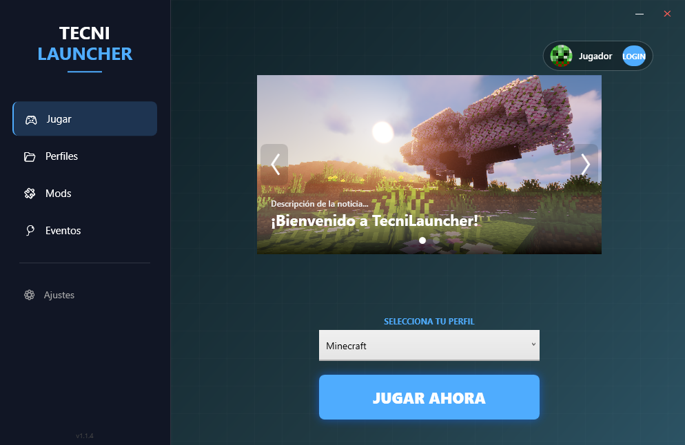
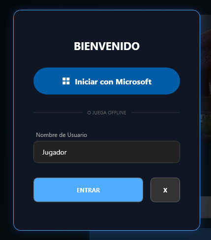
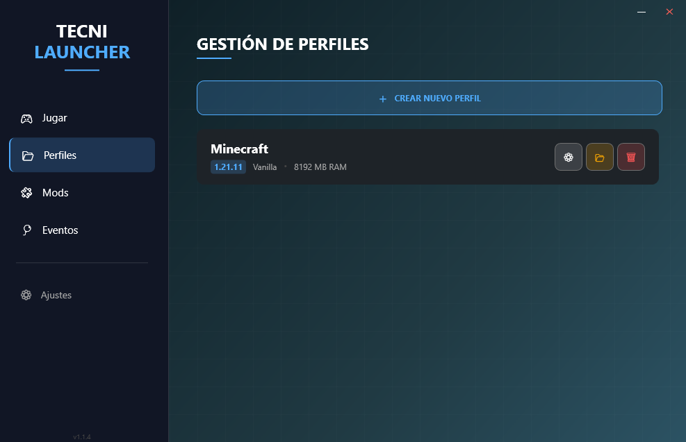
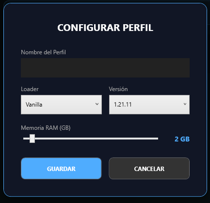
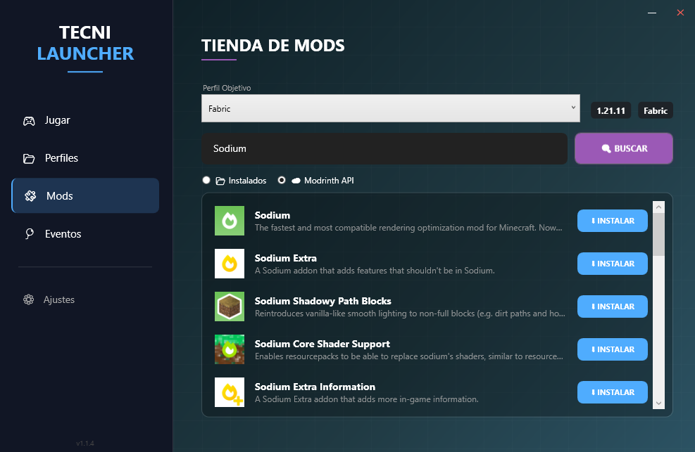

# 🎮 TecniLauncher
¡Bienvenido al lanzador técnico de Minecraft! Diseñado para ser ligero, elegante y funcional.

## ✨ Características

* **Diseño Moderno:** Interfaz limpia con noticias integradas.
  
  
* **Premium o Offline:** Puedes iniciar con tu cuenta de Microsoft o jugar de modo Offline, tú eliges.
  

* **Gestión de Perfiles:** Crea y edita tus perfiles de Vanilla, Forge, Fabric y NeoForge fácilmente.
  
  

* **Gestor de Mods:** Descarga de mods a través de la API de Modrinth.
  
* **Eventos:** Proximamente con experiencias con modpacks que se actualizan automaticamente. 

* **Actualizaciones Automáticas:** Mantente siempre en la última versión sin mover un dedo.
* **SISTEMA DE SKIN TODAVIA NO FUNCIONAL**
## SISTEMAS A IMPLEMENTAR
* Descarga de Modpacks
* Implementar sincronización con los proximos eventos
* Sistema mejorado de Versiones (ej: Fabric 0.18.4-1.21.11)

## 🚀 Descarga e Instalación
Para comenzar a jugar, descarga el instalador oficial desde el siguiente enlace:

[📥 DESCARGAR TECNILAUNCHER INSTALADOR](https://github.com/johan12390785/TecniLauncher-Data/raw/refs/heads/main/SetupV1.1.2/TecniLauncher_Setup.exe)
[Version antigua, al descargarlo te va a pedir actualizar]

## 🔒 Seguridad y Privacidad
Entendemos que la seguridad de tu cuenta de Minecraft es lo más importante. Por eso, TecniLauncher está diseñado con una política de **Transparencia Total**:

1.  **Sin Contraseñas:** TecniLauncher **NUNCA** tiene acceso a tu contraseña. El inicio de sesión se realiza a través del protocolo oficial de Microsoft (OAuth 2.0).
2.  **Librerías Certificadas:** Utilizamos `CmlLib.Core.Auth`, la librería de código abierto estándar de la comunidad para manejar la autenticación segura.
3.  **Código Abierto:** Todo el código fuente está disponible en este repositorio. Puedes revisar exactamente qué hacemos con los datos: solo guardamos el *token* de sesión localmente en tu PC para que no tengas que loguearte cada vez.

---

# 📜 Actualizaciones - TecniLauncher

Todas las mejoras, arreglos y optimizaciones del proyecto se documentarán aquí.

## v1.1.4 (Hotfix) - *Versión Actual*
* **Corrección Crítica:** Solucionado un error que impedía el correcto inicio de usuario Offline con el Minecraft.
* **Auto-Update:** Verificación exitosa del sistema de actualización automática en entorno real.

---

## v1.1.3 (Lanzamiento Estable)
* **Identidad:** Corrección del nombre de usuario (eliminado "tester123").
* **Interfaz:** Estabilización de la Vista de Juego y mejoras visuales en la barra de carga.

---

